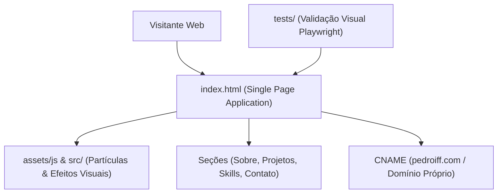

# DESIGN — Portfolio Architecture & Design Rules

## 1. Arquitetura da Interface

---

## 2. Princípios de Design

1. **Estética Sci-Fi & Minimalismo:**
   - Paleta de cores dark mode com acentos em ciano, roxo e verde neon.
   - Efeitos de HUD cibernético e animações de canvas interativas sem comprometer 60fps.
2. **Zero Dependências Pesadas em Produção:**
   - Vanilla JS e CSS otimizado para carregamento instantâneo.
